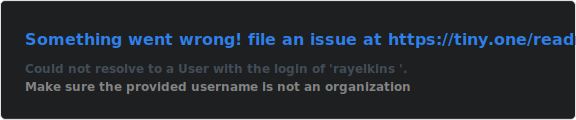

<!-- Ray Elkins — GitHub Profile README -->

---

### Hi, I'm Ray Elkins

Senior Solutions Architect at **AWS** · Technical Product Manager · Technical Product Manager · Focused on **Agentic AI use cases and Enterprise Security**

I spend my days helping enterprise customers architect secure, scalable cloud infrastructure on AWS. I bring both deep technical architecture expertise and product management skills to the problems I solve, with a growing focus on agentic AI systems and what they unlock for enterprise teams.

📍 San Diego, CA &nbsp;|&nbsp; 🎓 MBA, CSUSM &nbsp;|&nbsp; 🌐 [rayelkins.com](https://rayelkins.com) &nbsp;|&nbsp; 💼 [LinkedIn](https://www.linkedin.com/in/ray-elkins/)

---

### 🏗️ What I Work With

**Cloud & Infrastructure**

**Languages & Tools**

**AI & Product**

**Agentic Coding Tools**

---

### 📌 Featured Work

> *More projects coming soon, including agentic AI explorations, PRD artifacts, and AWS solution samples.*

#### 🔐 [AWS Secrets Manager Audit](https://github.com/aws-samples/sample-secrets-manager-audit)
Audit tool that surfaces access patterns and usage across AWS Secrets Manager to help teams identify unused or overly permissioned secrets.

  

#### 🔑 [KMS Key Access Audit](https://github.com/aws-samples/sample-kms-access-audit)
Audit tool that analyzes KMS key access patterns to help teams understand who is using which keys and identify least-privilege opportunities.

  

---

### 🎯 Current Focus

- 🤖 Building fluency with **agentic AI frameworks** (Bedrock Agents, LangChain, multi-agent orchestration)
- 📋 Developing **Technical PM artifacts**: PRDs, roadmaps, and discovery frameworks
- ☁️ Deepening expertise in **AWS security** and **Agent AI architecture**
- 🎓 Applying MBA-level product strategy to real-world Enterprise problems

---

### 📊 Activity

---

  Always building. Always learning.

